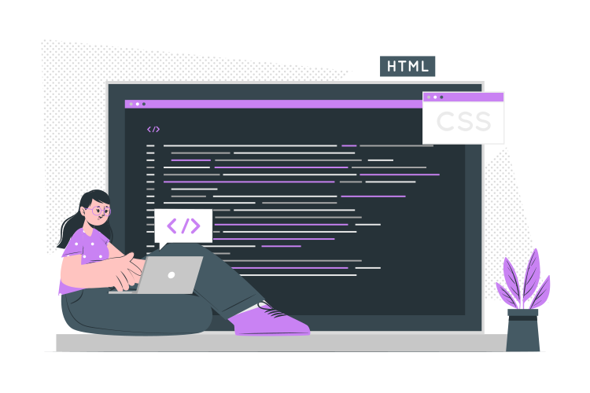

 
  Hi there! 👋🏼

  I have been working as a front-end engineer for about 4 years. I’m passionate about software development, problem-solving and technology. I’m always looking forward to learning more and improving my skills.

  Currently employed as a software engineer at [Mercado Livre](https://www.mercadolivre.com.br/), I work closely with agile teams, developing complex features with the latest cutting-edge development tools and procedures.

  In my spare time, you can find me reading fantasy novels and drinking a cup of tea.

  💌 Feel free to send a message if you want to know more about me. I am always eager to hear from others and expand my network here.

  
  

